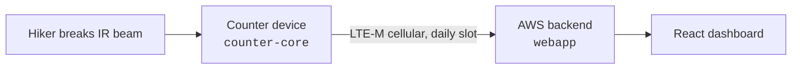

# TrailCount

TrailCount's mission is to **provide data that helps land stewards make
data-based decisions** — whether those stewards are public employees or work
for private foundations. The initial focus is the Adirondack Park in northern
New York, but the systems are not Adirondack-specific by design.

TrailCount is guided by [Adirondack Wilderness Advocates](https://www.adirondackwilderness.org/)
(AWA), a volunteer wilderness-advocacy non-profit. AWA is an advocacy
organization, not a technology development group; `trailcount.io` exists to
keep the technology development work separate from, but guided by, AWA. The
long-term organizational form of trailcount.io is still being worked out.

The work today falls in two lines:

- **Trail usage** — battery-powered devices at trailheads that detect
  hikers with an IR sensor, buffer timestamps locally, and report to an AWS
  backend, with a React dashboard for viewing usage. One device has been in
  the field at **The Garden trailhead** (Keene Valley, NY) since May 2026,
  reporting on a daily cellular slot.
- **Geospatial analysis** — interactive map applications describing the wild lands: remoteness from motorized access, trail steepness, and
  (proposed) a full trail-network database.

Public homepage: **[www.trailcount.io](https://www.trailcount.io/)**

This page is written for the people who work here — maintainers and student
collaborators. Most repositories are **private**; if a link 404s, that's why.
Ask for access.

---

## The deployed system

The device spends almost all of its life in deep sleep, wakes on a detection
or an RTC alarm, buffers to SD, and calls in once a day. Design target: a year
of operation on one set of batteries.

| Repo | What it is | State (as of 2026-09) |
|---|---|---|
| [counter-core](https://github.com/TrailCount/counter-core) | The firmware running on the fielded device: a hardware-free portable core (C++17, host-tested) plus platform ports. `platforms/stm32-counter` is the fielded build; `platforms/esp32-wifi` is an ESP32 variant. A new board is a new `platforms/<board>/` directory, not a new repository. | Active; `v2.4.0` in the field |
| [webapp](https://github.com/TrailCount/webapp) | Backend + dashboard: API Gateway, Lambda, DynamoDB, Cognito, React. Deployed as four tenant-scoped Terraform workspaces (`adk-prod`/`adk-test` for the real deployment, `demo-prod`/`demo-test` with synthetic data). | Active; in production |
| [homepage](https://github.com/TrailCount/homepage) | Static landing page at `trailcount.io`. S3 + CloudFront, no build step. | Live; the org's one public repo |
| [hardware-spikes](https://github.com/TrailCount/hardware-spikes) | Bench experiments with no home in `counter-core`. Currently one: an ESP32 demonstrating mutual TLS against the V2 device API. | Reference |

### V2 backend

| Repo | What it is | State |
|---|---|---|
| [v2-backend](https://github.com/TrailCount/v2-backend) | A second-generation backend built by the Trailblazers student team through August 2026 and adopted into this org on 2026-08-18. Certificate-authenticated device API, its own React app and Terraform. Includes the device emulator (`testing/device-emulator/`). | One test environment (`testv2`); operated in parallel with V1 |
| [device-emulator](https://github.com/TrailCount/device-emulator) | Python emulator for the V2 device API — certificates, registration, upload. | Archived; folded into `v2-backend` |

---

## Geospatial analysis

Both deployed apps are React + MapLibre GL single-page sites over Python data
pipelines, currently on test environments at CloudFront default URLs.

| Repo | What it is | State |
|---|---|---|
| [remexplore](https://github.com/TrailCount/remexplore) | **Remoteness Explorer**, built for AWA. Distance-to-motorized-access analysis across the Adirondack Park with scenario editing: remove a road or draw a proposed one and get defensible acreage for the change. Interactive field on the GPU; authoritative acreage from an exact distance transform on the server. Network edits are named, reviewable JSON packages, split into *corrections* (the data is wrong) and *proposals* (what if). | Working; not yet delivered to AWA users |
| [steepness](https://github.com/TrailCount/steepness) | **Steepness Explorer.** Park-wide map of hiking-trail grade computed from DEM elevation sampled along the DEC trail network; filter by unit, trail type, and minimum grade. Its README documents the known limits — grade is only as honest as the trail line on the DEM. | First release 2026-08; deployed to a test environment |
| [trailDB](https://github.com/TrailCount/trailDB) | **Trail Network Database and Data Platform** — from one data type at one point (hiker counts at trailheads) to the full network: a graph of segments, junctions, trailheads, and POIs, with routes as first-class entities and linked map / along-the-trail views. Proposed as an RIT Software Engineering senior project, sponsored by AWA, to be developed as open source. The proposal is in the repo under `docs/`. | Proposal; no code yet |

---

## Student projects

TrailCount has been built with RIT student teams from the start, drawing on
two colleges: counter **hardware and firmware** comes from the **Kate Gleason
College of Engineering**, and the **web applications** come from the
**Golisano College of Computing and Information Sciences** (Software
Engineering). Two efforts are in progress now:

- **Next-generation trail counter** (Gleason) — a new counter, compatible with
  the current webapp, that can deliver its data over **WiFi**, over
  **cellular**, or in a **disconnected mode** with no radio at all. Early
  stage; no repository yet.
- **Trail network database** (Golisano) — A new Golisano Software Engineering senior project above
  ([trailDB](https://github.com/TrailCount/trailDB)).

Completed student work this org grew from: the original trail counter
(Gleason MSD capstone P24572, 2024–25) and the V2 backend (Trailblazers SE
team, Golisano, 2025–26).
Both are preserved — the original firmware in the maintainer's
[trail-counter-firmware](https://github.com/craigmcg) (frozen 2026-05-25,
superseded by `counter-core`), and every Trailblazers branch tip as
`student-final/*` tags in `v2-backend`.

---

## How we work here

- **Private by default.** Only `homepage` is public today. trailDB commits to
  open-source development from the start.
- **Terraform is the source of truth** for every deployment, with
  per-environment workspaces. **Always pass the matching
  `-var-file=<workspace>.tfvars`** — a bare invocation loads the wrong
  variables and produces a destructive plan. This is the single most important
  operational rule in the org.
- **Resource prefixes name the product and environment** (`tc-adk-prod-`,
  `rx-test-`, `sx-test-`, …) so anything in the AWS account traces back to the
  repo that owns it.
- **Push to `main` deploys** for `webapp` and `v2-backend`, via the same
  OIDC-based GitHub Actions pipeline — two stacks, one way to operate them.
- **Docs live with the code.** Each repo's `README.md` is its front door; its
  `CLAUDE.md`, where present, is the operational runbook.

---

Maintained by <a href="https://github.com/craigmcg">@craigmcg</a> · Guided by <a href="https://www.adirondackwilderness.org/">Adirondack Wilderness Advocates</a>
