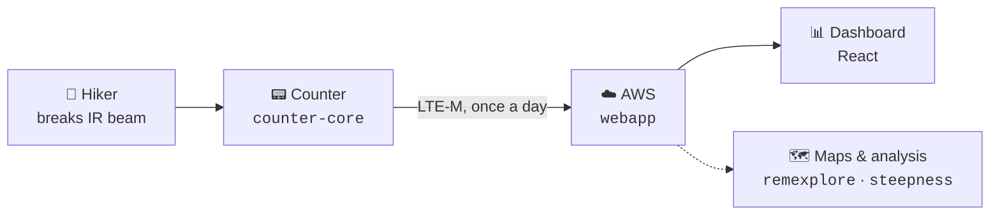

# TrailCount

**How many people actually walked that trail?**

TrailCount answers that question for backcountry trailheads. A battery-powered
counter sits at the trail register, detects hikers with an infrared sensor,
timestamps each one, and uploads batches over LTE-M cellular. A web dashboard
turns those timestamps into usage a land steward can plan around.

Sponsored by [Adirondack Wilderness Advocates](https://www.adirondackwilderness.org/).
It began as an RIT senior design capstone (MSD P24572) and has since grown into a
system that stands on its own — its own domain, its own hardware line, its own
deployments.

🌲 **[www.trailcount.io](https://www.trailcount.io/)** &nbsp;·&nbsp; 📍 First unit in the
field at **The Garden trailhead**, Keene Valley NY, reporting daily.

---

## How the pieces fit

The device sleeps almost all of its life, wakes on a detection or an RTC alarm,
buffers to SD, and calls home on a fixed daily slot — the design target is a year
of operation on one set of batteries.

---

## Repositories

Most repos here are **private** — if a link 404s for you, that's why, not a broken
link. Ask for an invite.

### 🛠️ The counter

| Repo | What it is | Status |
|---|---|---|
| **[counter-core](https://github.com/TrailCount/counter-core)** | The firmware **actually running on the device**. A hardware-free portable core (C++17, host-tested) plus its platform ports: `platforms/stm32-counter` is what's at The Garden, `platforms/esp32-wifi` is the low-cost variant. A new board is a new `platforms/<board>/`, not a new repo. | 🟢 **Active** — `v2.4.0` in the field |
| **[webapp](https://github.com/TrailCount/webapp)** | V1 cloud backend and the React dashboard. API Gateway + Lambda + DynamoDB + Cognito, deployed as four tenant-scoped Terraform workspaces. This is the production system. | 🟢 **Active** — in production |
| **[homepage](https://github.com/TrailCount/homepage)** | The static landing page at `trailcount.io`. No build step; S3 + CloudFront. | 🟢 **Live** · 🌍 public |
| **[hardware-spikes](https://github.com/TrailCount/hardware-spikes)** | Bench experiments with no home in `counter-core`. Currently one: an ESP32 proving the **mutual-TLS** path, since nothing in `counter-core` speaks mTLS. | 🟡 **Reference** — relevant only if V2 becomes the firmware target |

### 🔀 V2 — the parallel line

| Repo | What it is | Status |
|---|---|---|
| **[v2-backend](https://github.com/TrailCount/v2-backend)** | A second-generation backend built by the *Trailblazers* student team through August 2026, **adopted in-house on 2026-08-18**. Certificate-authenticated devices, its own React app, its own Terraform. Includes the device emulator at `testing/device-emulator/`. | 🟡 **Parallel line** — one environment, future deliberately undecided |
| **[device-emulator](https://github.com/TrailCount/device-emulator)** | Python emulator for the V2 device API — certificates, registration, upload. Proven end to end. | 🗄️ **Archived** — folded into `v2-backend` |

V1 and V2 run as **separate parallel tracks that may re-merge later**. V2 is not
assumed to replace V1; it's kept alive, deployed, and understood while the
question stays open.

### 🗺️ Maps & analysis

Same park, same brand, same geographic layers as the counter — different questions.

| Repo | What it is | Status |
|---|---|---|
| **[remexplore](https://github.com/TrailCount/remexplore)** | **AWA Remoteness Explorer.** Interactive analysis of distance-to-motorized-access across the 5.82M-acre Adirondack Park. Close a road, draw a proposed route, watch remote core grow or fragment — then get defensible acreage for the scenario. | 🟢 **Active** |
| **[steepness](https://github.com/TrailCount/steepness)** | **Steepness Explorer.** Park-wide map of hiking-trail grade, computed from DEM elevation sampled along the DEC trail network. Filter, compare, click a pitch for its numbers. | 🌱 **New** — first release 2026-08 |
| **[trailDB](https://github.com/TrailCount/trailDB)** | A shared trail-network database, to give the map projects one canonical set of trail geometry instead of three. | 🔵 **Placeholder** — staked out, not yet started |

---

## Where things stand

- 🟢 **The device works.** The Garden unit calls in on its daily slot with full
  drains and no backlog, and the data shows a real trailhead curve — weekend-peaked,
  busiest 06:00–09:00. A long 2026-07 outage was resolved in the field that August.
- 🟢 **Four tenant stacks live** — production and test for the AWA deployment, plus
  a synthetic-data demo pair, all on `trailcount.io` with per-tenant isolation.
- 🟡 **V2 is understood and parked warm** — adopted, redeployed on our own pipeline,
  costing a few dollars a month while its role gets decided.
- 🌱 **The map side is growing.** Remoteness shipped; steepness just landed; a shared
  trail database is the next thing to build under them.

---

## How we work here

A few conventions that hold across the org:

- **Private by default.** Only `homepage` is public. Everything else is invite-only.
- **Terraform is the source of truth** for every deployment, with per-environment
  workspaces. Always pass the matching `-var-file` — a bare invocation targets the
  wrong environment, and that is destructive.
- **Resource prefixes name the product and environment** (`tc-adk-prod-`, `rx-`, …),
  so anything in the AWS account can be traced back to the repo that owns it.
- **Push to `main` deploys.** Both `webapp` and `v2-backend` use the same OIDC-based
  GitHub Actions pipeline, on purpose — two stacks, one way to operate them.
- **Docs live with the code.** Each repo's `README.md` is the front door and its
  `CLAUDE.md`, where present, is the operational runbook.

### Elsewhere

Two related repos live outside this org, under
[@craigmcg](https://github.com/craigmcg): `trailcount-workspace` (cross-cutting
planning notes spanning firmware, backend, and site) and `trail-counter-firmware`
(the original CubeMX/HAL student build — **frozen 2026-05-25**, superseded by
`counter-core`, kept as the historical record).

---

Adirondack Park, New York · Maintained by <a href="https://github.com/craigmcg">@craigmcg</a> · Sponsored by <a href="https://www.adirondackwilderness.org/">Adirondack Wilderness Advocates</a>
