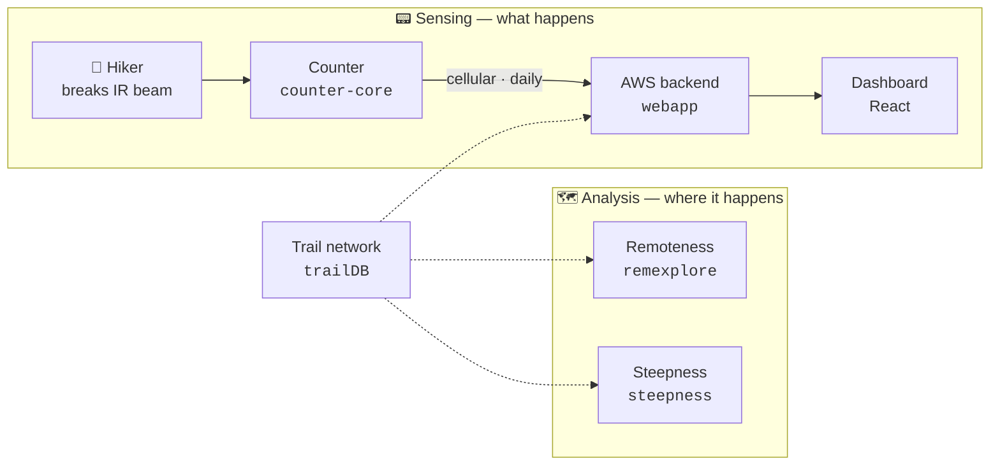

# TrailCount

**Measuring wild places, and how people move through them.**

TrailCount builds field instruments and analysis tools for backcountry land
stewardship in the **Adirondack Park** — 5.82 million acres of public and private
land in northern New York.

The work has two halves that meet on the same map:

- 📟 **Instruments that count what happens.** Battery-powered trail counters that
  sit at a trailhead for a year, detect each hiker with an infrared sensor, and
  report home — plus the cloud and dashboard that turn those timestamps into usage
  a land manager can plan around.
- 🗺️ **Maps that describe the land it happens on.** Interactive analysis of the
  terrain itself: how far a place is from the nearest road, how steep a trail
  really climbs, and what changes if a road closes or a route is added.

The common thread is **defensible numbers**. Wilderness decisions get made with
thin data and strong opinions; everything here exists to replace an estimate with
a measurement, and to show its work when someone disagrees.

Sponsored by [Adirondack Wilderness Advocates](https://www.adirondackwilderness.org/).
The counter began as an RIT senior design capstone (MSD P24572) and has since grown
into a system that stands on its own — its own domain, hardware line, and deployments.

🌲 **[www.trailcount.io](https://www.trailcount.io/)** &nbsp;·&nbsp; 📍 First counter
in the field at **The Garden trailhead**, Keene Valley NY, reporting daily.

---

## How it fits together

The same park, the same trail geometry, the same brand. `trailDB` is the shared
foundation being built underneath all of it.

---

## 📟 Counting people

The device sleeps for almost all of its life, wakes on a detection or an RTC alarm,
buffers timestamps to SD, and calls home on a fixed daily slot. The design target is
a year of operation on one set of batteries.

| Repo | What it is | Status |
|---|---|---|
| **[counter-core](https://github.com/TrailCount/counter-core)** | The firmware **actually running on the device**. A hardware-free portable core (C++17, host-tested) plus its platform ports: `platforms/stm32-counter` is what's at The Garden, `platforms/esp32-wifi` is an ESP32-as-CPU-and-radio variant. A new board is a new `platforms/<board>/`, not a new repo. | 🟢 **Active** — `v2.4.0` in the field |
| **[webapp](https://github.com/TrailCount/webapp)** | The cloud backend and React dashboard. API Gateway + Lambda + DynamoDB + Cognito, deployed as four tenant-scoped Terraform workspaces. This is the production system. | 🟢 **Active** — in production |
| **[homepage](https://github.com/TrailCount/homepage)** | The static landing page at `trailcount.io`. No build step; S3 + CloudFront. | 🟢 **Live** · 🌍 public |
| **[hardware-spikes](https://github.com/TrailCount/hardware-spikes)** | Bench experiments with no home in `counter-core`. Currently one: an ESP32 proving the **mutual-TLS** path, since nothing in `counter-core` speaks mTLS. | 🟡 **Reference** |

### 🚧 Underway — a counter that works anywhere

A **new student team is building the next-generation trail counter**, designed around
the observation that no single radio suits every trailhead. The target is one device
with three ways to deliver its data:

- 📶 **WiFi** — where a trailhead has a nearby network, the cheapest and fastest link.
- 📡 **Cellular** — the current model, for remote sites with coverage.
- 📴 **Disconnected** — no radio at all. The counter buffers to local storage and is
  collected on a visit, so a site with neither WiFi nor a signal still gets counted.

That last mode matters most: the places worth measuring are often exactly the places
with no way to phone home. **No repository yet** — the project is in its early stage,
and its target API and relationship to `counter-core` are still open questions.

---

## 🔀 V2 — the parallel line

| Repo | What it is | Status |
|---|---|---|
| **[v2-backend](https://github.com/TrailCount/v2-backend)** | A second-generation backend built by the *Trailblazers* student team through August 2026, **adopted in-house on 2026-08-18**. Certificate-authenticated devices, its own React app, its own Terraform. Includes the device emulator at `testing/device-emulator/`. | 🟡 **Parallel line** — one environment |
| **[device-emulator](https://github.com/TrailCount/device-emulator)** | Python emulator for the V2 device API — certificates, registration, upload. Proven end to end. | 🗄️ **Archived** — folded into `v2-backend` |

V1 and V2 run as **separate tracks that may re-merge later**. V2 is not assumed to
replace V1; it's kept deployed and understood while the question stays open.

---

## 🗺️ Reading the land

Two map applications, same park and same geographic layers as the counter, asking
different questions about the terrain. Both are static SPAs (React + MapLibre GL)
over a Python ingest pipeline, and both are built so the interesting parameters are
**UI controls rather than pipeline constants** — because the choice of threshold is
usually the argument.

### [remexplore](https://github.com/TrailCount/remexplore) — the AWA Remoteness Explorer &nbsp;🟢 **Active**

**How far is this from the nearest engine?** Remoteness defined strictly as distance
to motorized access — a road, ATV trail, snowmobile trail, or motorized waterbody.
Land within a short distance is a *disturbance zone*; land beyond a long distance is
*remote core*. Both thresholds are sliders.

The point is **scenario analysis**: click a road to take it out of the network as a
proposed closure, or draw a new one, and watch remote core grow or fragment — then
get defensible acreage for that scenario. Changes are never silent. Every edit is a
named, toggleable **package**, either a *correction* (the data is wrong, this fixes
it) or a *proposal* (the data is right, this asks "what if") — plain JSON, reviewable
and diffable.

Whether a logging track counts like a state highway changes the answer by about
**2.6×**, which is exactly why it's a control and not a constant. The interactive map
runs entirely on the GPU via jump flooding; the server is reserved for the one thing
the GPU can't do honestly — authoritative acreage from an exact distance transform.
*GPU for exploring, server for numbers.*

### [steepness](https://github.com/TrailCount/steepness) — the Steepness Explorer &nbsp;🌱 **New** (2026-08)

**How hard is this climb, really?** A park-wide map of hiking-trail grade, coloured
on a 0% → 40%+ ramp, computed from elevation sampled along the DEC trail network.
Click a pitch for its grade; get length, max, mean, and total gain for the trail;
filter by management unit, trail type, or hide anything gentler than *X*%.

Trail lines are densified so no segment exceeds 20 m before sampling — otherwise a
bench and a slide average into a polite number that describes neither. It is honest
about its limits: grade is only as good as the trail line sitting on the elevation
model, so isolated 80%+ pitches are usually a switchback drawn as a straight chord,
not a climb you could sustain. Mean grade along a named trail is the number to trust.

---

## 🧱 Shared ground

| Repo | What it is | Status |
|---|---|---|
| **[trailDB](https://github.com/TrailCount/trailDB)** | A shared trail-network database, to give the counter and both map projects **one canonical set of trail geometry** instead of three drifting copies. | 🔵 **Placeholder** — staked out, not yet started |

---

## Where things stand

- 🟢 **The counter works.** The Garden unit calls in on its daily slot with full
  drains and no backlog, and the data shows a real trailhead curve — weekend-peaked,
  busiest 06:00–09:00. A long 2026-07 outage was resolved in the field that August.
- 🟢 **Four tenant stacks live** — production and test for the AWA deployment, plus a
  synthetic-data demo pair, all on `trailcount.io` with per-tenant isolation.
- 🚧 **The next counter is in design** — WiFi, cellular, and disconnected, with a new
  student team on it and no repo yet.
- 🟡 **V2 is understood and parked warm** — adopted, redeployed on our own pipeline,
  costing a few dollars a month while its role gets decided.
- 🌱 **The map side is growing.** Remoteness shipped; steepness just landed; a shared
  trail database is the next thing to build under both.

---

## How we work here

A few conventions that hold across the org:

- **Private by default.** Only `homepage` is public. If a link above 404s for you,
  that's why — it isn't broken. Ask for an invite.
- **Terraform is the source of truth** for every deployment, with per-environment
  workspaces. Always pass the matching `-var-file` — a bare invocation targets the
  wrong environment, and that is destructive.
- **Resource prefixes name the product and environment** (`tc-adk-prod-`, `rx-`,
  `sx-`, …), so anything in the AWS account traces back to the repo that owns it.
- **Push to `main` deploys.** `webapp` and `v2-backend` share the same OIDC-based
  GitHub Actions pipeline on purpose — two stacks, one way to operate them.
- **Show the work.** Thresholds are controls, edits are named packages, and the known
  limits go in the README. A number nobody can argue with is a number nobody checked.
- **Docs live with the code.** Each repo's `README.md` is the front door; its
  `CLAUDE.md`, where present, is the operational runbook.

### Elsewhere

Two related repos live outside this org, under
[@craigmcg](https://github.com/craigmcg): `trailcount-workspace` (cross-cutting
planning notes spanning firmware, backend, and site) and `trail-counter-firmware`
(the original CubeMX/HAL student build — **frozen 2026-05-25**, superseded by
`counter-core`, kept as the historical record).

---

Adirondack Park, New York · Maintained by <a href="https://github.com/craigmcg">@craigmcg</a> · Sponsored by <a href="https://www.adirondackwilderness.org/">Adirondack Wilderness Advocates</a>
